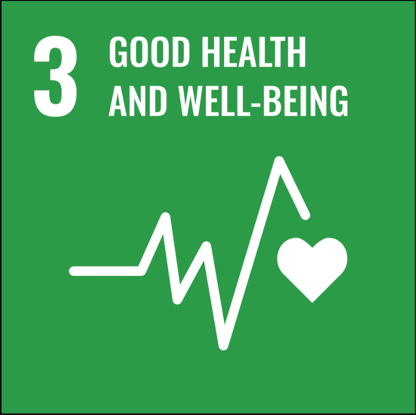
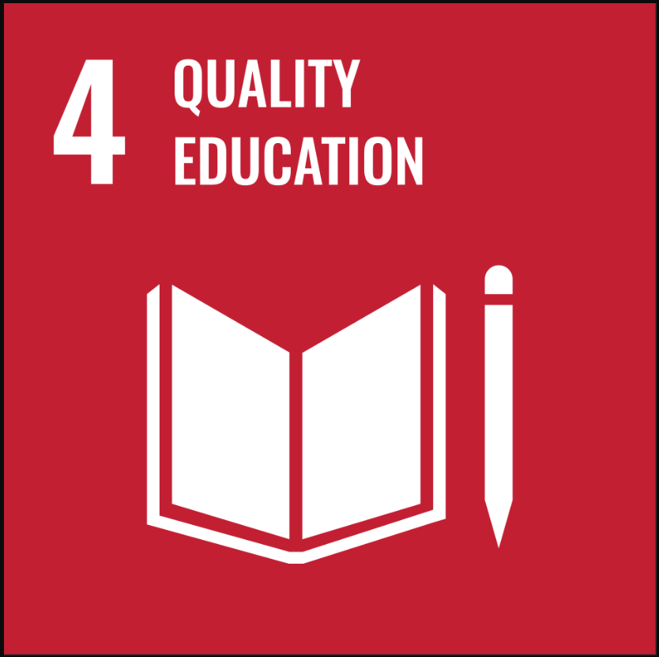
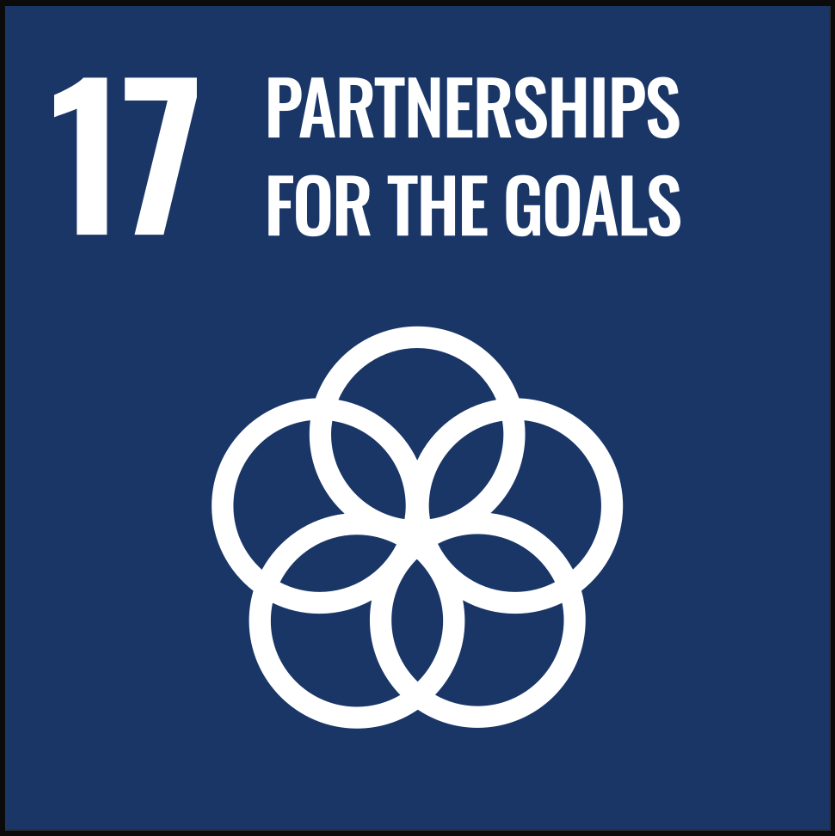

<br><br>

::: {#hero-heading}

I’m a Psychology Technician ([PsychTech](https://wu-psychology-technician.github.io/)) at [Wrexham University](https://wrexham.ac.uk/), and a researcher interested in Bayesian Statistics, Psychometrics and Mental Health. I also enjoy doing outreach in statistics for psychology. 
:::


::: {#Skills-heading .skills-section}
## Skills

::: {.skills-grid}

::: {.skill-item}


[R]{.section-subheading}
:::

::: {.skill-item}


[Bayesian Statistics]{.section-subheading}
:::

::: {.skill-item}


[Computational Modeling]{.section-subheading}
:::

::: {.skill-item}


[Virtual Reality]{.section-subheading}
:::

::: {.skill-item}


[Psychology]{.section-subheading}
:::

:::
:::

::: {#goals-heading .goals-section}
## Sustainable Development Goals

Although not directly working with, some of my academic interests and underlying goals follow several targets of the [Sustainable Development Goals](https://www.undp.org/sustainable-development-goals) set out by the [United Nations](https://sdgs.un.org/goals). Engaging with the public and aligning research with national and international priorities is an important part of academic work, and this is one way I try to show that engagement with wider society.

```{=html}
<div class="goals-grid">
  <a class="goal-item" href="https://www.undp.org/sustainable-development-goals/good-health" target="_blank" rel="noopener noreferrer">
    
  </a>
  <a class="goal-item" href="https://www.undp.org/sustainable-development-goals/quality-education" target="_blank" rel="noopener noreferrer">
    
  </a>
  <a class="goal-item" href="https://www.undp.org/sustainable-development-goals/partnerships-for-the-goals" target="_blank" rel="noopener noreferrer">
    
  </a>
</div>
```




Please look at the [About](sam-vizcaino-vickers.github.io/about/) section to find more about my specific interests related to my academic work.

:::

::: {#partnerships-collaboration}

# Collaborations 

If you seek to discuss potential collaborations for academic publications, conduct collaborative research, or any other enquiries then please do contact me via [sam.vickers@wrexham.ac.uk](mailto:sam.vickers@Wrexham.ac.uk). 
:::


  


